# Arquitectura de microservicios de TikTok

## Alcance y nivel de certeza

TikTok no publica un inventario completo de sus microservicios ni un diagrama oficial de su arquitectura interna. Por esa razón, este documento presenta una **arquitectura de referencia académica**, reconstruida a partir de capacidades que TikTok y ByteDance sí documentan públicamente.

En el diagrama:

- Los elementos verdes representan capacidades respaldadas por documentación pública.
- Los elementos azules son separaciones de microservicios propuestas para explicar el sistema.
- Los elementos grises representan infraestructura necesaria para soportar una plataforma de este tipo, pero no confirman productos internos concretos.

## Diagrama

```mermaid
flowchart TB
    usuarios[Usuarios y creadores]
    clientes[Aplicaciones móvil y web]
    edge[CDN, protección perimetral y balanceo]
    gateway[API Gateway]

    usuarios --> clientes
    clientes --> edge
    edge --> gateway

    subgraph capacidades[Servicios de negocio]
        auth[Autenticación y cuentas]
        perfil[Perfiles y relaciones sociales]
        publicaciones[Publicación de contenido]
        video[Procesamiento de video]
        feed[Feed Para ti]
        recomendaciones[Recomendación y ranking]
        interacciones[Me gusta, comentarios y compartidos]
        busqueda[Búsqueda y tendencias]
        mensajeria[Mensajería y notificaciones]
        moderacion[Moderación y seguridad]
        publicidad[Publicidad]
    end

    gateway --> auth
    gateway --> perfil
    gateway --> publicaciones
    gateway --> feed
    gateway --> interacciones
    gateway --> busqueda
    gateway --> mensajeria
    gateway --> publicidad

    publicaciones --> video
    publicaciones --> moderacion
    video --> objetos
    video --> cdn

    feed --> recomendaciones
    recomendaciones --> catalogo
    recomendaciones --> caracteristicas
    interacciones --> eventos
    perfil --> eventos
    publicaciones --> eventos
    eventos --> caracteristicas
    eventos --> analitica

    moderacion --> publicaciones
    mensajeria --> push
    publicidad --> pagos

    subgraph datos[Datos y procesamiento]
        catalogo[(Metadatos de contenido y usuarios)]
        objetos[(Almacenamiento de videos e imágenes)]
        cache[(Caché distribuida)]
        eventos[[Bus de eventos]]
        caracteristicas[(Almacén de características para ML)]
        analitica[(Lago de datos y analítica)]
    end

    auth --> catalogo
    perfil --> catalogo
    publicaciones --> catalogo
    interacciones --> catalogo
    feed --> cache
    busqueda --> catalogo

    subgraph externos[Sistemas externos]
        cdn[Red de distribución de contenido]
        push[Servicios push del dispositivo]
        pagos[Pasarela de pagos]
    end

    classDef documentado fill:#d9ead3,stroke:#38761d,color:#000;
    classDef propuesto fill:#cfe2f3,stroke:#0b5394,color:#000;
    classDef infraestructura fill:#eeeeee,stroke:#666,color:#000;

    class auth,publicaciones,recomendaciones documentado;
    class perfil,video,feed,interacciones,busqueda,mensajeria,moderacion,publicidad propuesto;
    class edge,gateway,catalogo,objetos,cache,eventos,caracteristicas,analitica,cdn,push,pagos infraestructura;
```

## Responsabilidad de los servicios

| Servicio | Responsabilidad principal | Certeza |
|---|---|---|
| Autenticación y cuentas | Inicio de sesión, autorización y ciclo de vida de tokens | Capacidad pública documentada |
| Perfiles y relaciones sociales | Datos del perfil, seguidores y cuentas seguidas | Límite de servicio propuesto |
| Publicación de contenido | Inicio, seguimiento y finalización de la publicación | Capacidad pública documentada |
| Procesamiento de video | Validación, transcodificación y generación de versiones | Límite de servicio propuesto |
| Feed «Para ti» | Construcción y entrega del feed personalizado | Límite de servicio propuesto |
| Recomendación y ranking | Selección y ordenamiento del contenido mediante señales | Capacidad pública documentada |
| Interacciones | Me gusta, comentarios, visualizaciones y compartidos | Límite de servicio propuesto |
| Búsqueda y tendencias | Recuperación de contenido, cuentas, sonidos y etiquetas | Límite de servicio propuesto |
| Mensajería y notificaciones | Mensajes y avisos para los usuarios | Límite de servicio propuesto |
| Moderación y seguridad | Revisión automática y humana de contenido y reportes | Límite de servicio propuesto |
| Publicidad | Campañas, selección de anuncios y medición | Límite de servicio propuesto |

## Flujo principal de publicación

1. El creador se autentica y solicita publicar un video.
2. El servicio de publicación recibe los metadatos e inicia la carga.
3. El contenido se almacena y se procesa para producir formatos reproducibles.
4. El servicio de moderación evalúa el contenido antes o durante su distribución.
5. Los metadatos aprobados pasan al catálogo y generan eventos.
6. El contenido queda disponible para el sistema de recomendación y para su entrega mediante una CDN.

## Flujo principal de recomendación

1. Las reproducciones, finalizaciones, comentarios, compartidos y otras interacciones generan eventos.
2. El procesamiento de datos transforma esos eventos en características de usuarios y contenidos.
3. El servicio de recomendación obtiene candidatos y les asigna una puntuación.
4. El servicio del feed aplica reglas de elegibilidad, diversidad y seguridad.
5. Los videos seleccionados se entregan al cliente; los archivos multimedia se descargan desde la CDN.

## Fuentes públicas utilizadas

- [TikTok: cómo recomienda videos el feed Para ti](https://newsroom.tiktok.com/how-tiktok-recommends-videos-for-you): documenta señales como interacciones, información del video y configuración del dispositivo o de la cuenta.
- [TikTok for Developers: Content Posting API](https://developers.tiktok.com/docs/en/content-posting-api-get-started): documenta la inicialización de publicaciones, la carga del archivo y la consulta del estado.
- [TikTok for Developers: Login Kit](https://developers.tiktok.com/docs/en/login-kit-overview): documenta autenticación y autorización mediante OAuth 2.0.
- [CloudWeGo Hertz](https://github.com/cloudwego/hertz): framework HTTP para microservicios desarrollado según necesidades internas de ByteDance y utilizado dentro de la empresa.
- [CloudWeGo](https://github.com/cloudwego/community): ecosistema iniciado en ByteDance que incluye componentes HTTP, RPC y de red para construir sistemas de microservicios.

Estas fuentes respaldan capacidades y tecnologías generales. No permiten afirmar que cada caja del diagrama corresponda exactamente a un microservicio desplegado actualmente por TikTok.
