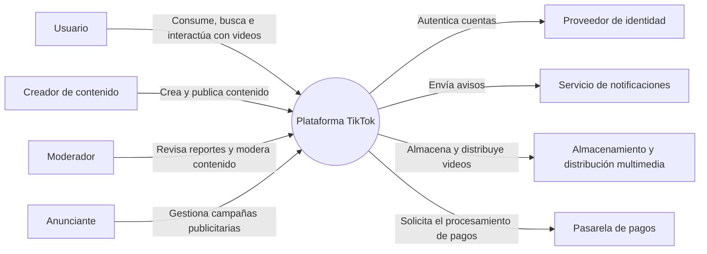

# Diagrama de contexto: TikTok

## Objetivo

Este documento presenta el nivel de contexto del modelo C4 para TikTok. Su propósito es mostrar, de forma general, quiénes interactúan con la plataforma y qué sistemas externos se relacionan con ella.

> Esta es una representación académica elaborada para el curso de Arquitectura de Software. No describe la arquitectura interna oficial de TikTok.

## Descripción del sistema

TikTok es una plataforma digital para crear, publicar, descubrir y compartir videos cortos. El sistema ofrece contenido personalizado según las interacciones y preferencias de cada usuario. También permite seguir cuentas, comentar, reaccionar, compartir contenido y recibir notificaciones.

## Actores

- **Usuario:** observa videos, busca contenido, interactúa con publicaciones y administra su cuenta.
- **Creador de contenido:** graba, edita y publica videos; además, consulta la interacción obtenida por sus publicaciones.
- **Moderador:** revisa contenido reportado y aplica las políticas de la comunidad.
- **Anunciante:** administra campañas publicitarias y consulta sus resultados.

## Sistemas externos

- **Proveedor de identidad:** permite el registro o inicio de sesión mediante cuentas externas.
- **Servicio de notificaciones:** entrega notificaciones push a los dispositivos de los usuarios.
- **Servicio de almacenamiento y distribución:** conserva los archivos multimedia y distribuye los videos a diferentes regiones.
- **Pasarela de pagos:** procesa pagos relacionados con publicidad, compras u otras funciones monetizadas.

## Diagrama de contexto

## Alcance

El sistema incluye las funciones visibles de la plataforma: gestión de cuentas, publicación y reproducción de videos, recomendaciones, interacciones sociales, moderación, publicidad y notificaciones.

Quedan fuera de este nivel de análisis los detalles de implementación, los componentes internos, las bases de datos, los algoritmos específicos y la infraestructura física. Estos elementos corresponden a niveles más detallados del modelo C4.

## Requisitos principales

### Funcionales

- Registrar e identificar usuarios.
- Publicar, reproducir, buscar y compartir videos.
- Recomendar contenido personalizado.
- Permitir reacciones, comentarios y seguimiento de cuentas.
- Reportar y moderar contenido.
- Gestionar campañas publicitarias.
- Enviar notificaciones.

### De calidad

- Alta disponibilidad para usuarios de distintas regiones.
- Baja latencia durante la reproducción de videos.
- Escalabilidad para soportar grandes cantidades de usuarios y contenido.
- Protección de cuentas, datos personales y contenido.
- Tolerancia a fallos en los servicios principales.
- Capacidad de moderar contenido y responder a reportes.
